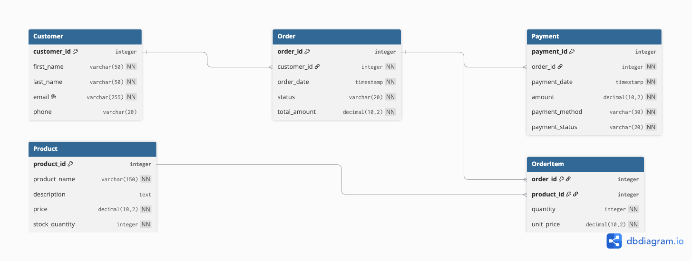

# Online Store Database

A relational database design for a simple online store that manages customers, products, orders, order items, and payments.

## Chosen Theme

Online Store / E-commerce Platform

## Domain

This project models a simple online shopping platform. Customers can place orders for products available in the store. Each order contains one or more order items that identify the products purchased and their quantities. The system also stores payment information associated with customer orders.

The database is designed to answer important questions about the platform, such as which orders belong to a customer, which products are included in an order, how many units of each product were purchased, and which payments are associated with an order. The five main relations are Customer, Product, Order, OrderItem, and Payment.

The design uses primary keys, foreign keys, and integrity constraints to keep the data consistent. OrderItem connects orders and products, while the other foreign key relationships ensure that orders belong to valid customers and payments belong to valid orders.

## Entity Relationship Diagram

